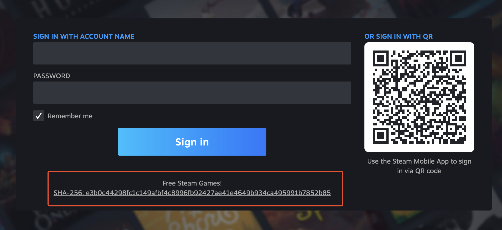
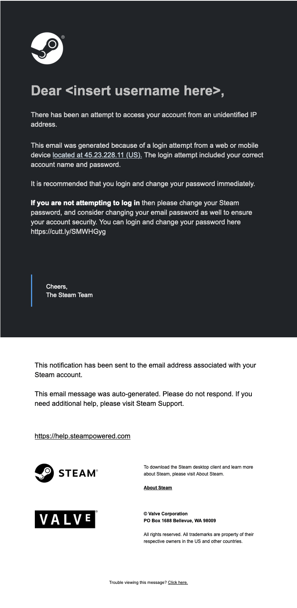

# Project Report

## Goal

The goal of this project is to create a phishing site that mimics [Steam](https://store.steampowered.com/). The site will be able to capture the user's credentials and send them to the attacker i.e. the database.

It also exposes an SQL injection vulnerability, and provides a "malware" download.

## Approach

### Stack

- Flask (Python) for the backend
- Plain HTML/CSS/JS for the frontend
- PostgreSQL for the database
- Docker for easy deployment and dependency management

### Phishing

The two methods I've chosen for phishing are:

- Fake email
- Fake steam tweet

### Process

I first had to get the structure of the site from the original Steam website. I mainly utilized the browser dev tools to scrape the source files and did some tweaking to get them to work with my implementation. Overall, it seemed like a pretty straightforward process, and the result is a site that's almost identical to the original.

I then had to implement the login functionality, which is very easy with Flask. Once I was able to deploy the database, it was just a matter of connecting the Flask app with SQLAlchemy and the database. The login functionality specifically is a route that receives the user's credentials through an HTML form and sends them to the database.

A part of the login process is the ability to exploit an SQL injection vulnerability, due to the raw query sent in the Flask app. A simple `', ' '); Drop Table public.logins;--` was enough to prove the vulnerability.

The last part of the project itself was to provide "malware" for the user to download. It's just an empty file, but it's enough to prove the concept. `free-steam-games.exe` is the file that's provided, and has a hash along with it.

I was able to deploy the site locally and expose it publicly using ngrok, which automatically signs the certificate.

#### malware & hash


## Problems

Honestly there were not many problems other than the deployment of the app itself. The app runs on localhost just fine, but I was able to expose it to the internet publicly through the use of a reverse tunnel. I used [ngrok](https://ngrok.com/) to do this, and it was pretty easy to set up. I just had to run the command `ngrok http 4000` and it would give me a link to the site. Though in practice this is not the best way to do it, but it was a good proof of concept.

The other main problem was the SQL injection vulnerability. At first I was using the SQLAlchemy API to manage table entries, but I believe this had some built-in form of data sanitization. I had to switch to raw SQL queries to get the vulnerability to work.

```python
db.session.execute(
        "INSERT INTO logins VALUES(" + str(num_rows+1) + ", '" + username + "', '" + password + "')")
```

## Conclusion

Overall the project was relatively straightforward, but an interesting learning experience since I've never attempted something like this before. I learned a bit about Flask, database management, some web dev, and how to deploy a web app. I also learned about the importance of sanitizing user input, and how to do it properly.

## Deliverables

- [x] Phishing Methods

#### email



#### tweet


- [x] Database
- [x] Credentials
- [x] Redirect to original Steam site
- [x] TLS Certificate
- [x] SQL Injection
- [x] Malware

[Demonstration Video](https://drive.google.com/file/d/1dVZTz4nJFag7lLXWXSMSS37td6s0HDyZ/view?usp=share_link)

[Source Code & Instructions](https://github.com/Ethan0429/cs-366-project/tree/main#deployment-instructions)

## Deployment Instructions

1. Install Docker
2. Clone the repository
3. Run `make` in the root directory
5. After a few seconds, the site should be up and running at `localhost:4000`. The database should be accessible at `localhost:8080` with the credentials being `postgres` for everything.
6. To stop the containers and remove the images/db volumes, run `make clean`
